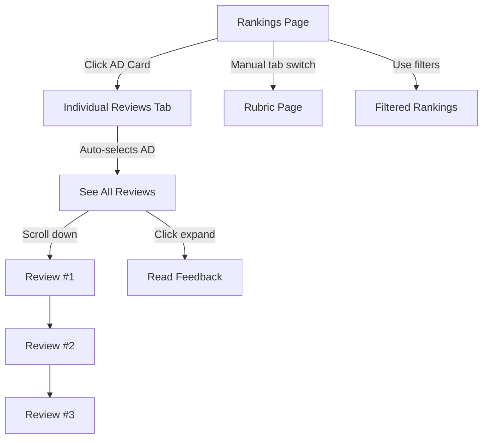

# Executive Dashboard Refactor - Ranking-First Workflow

## 🎯 Goal Achieved
Transformed the dashboard from a detail-heavy interface to an **executive-focused, ranking-first evaluation tool** optimized for quick comparison and validation.

---

## 📊 Page 1: Rankings & Performance (PRIMARY VIEW)

### Purpose
Enable executives to answer: **"Who is strongest, who is weakest, and how do they compare?"**

### Major Changes

#### ✅ **Simplified Card Design**
**Before:**
- Dense 8-section grid on every card
- Too much information to scan quickly
- No clear visual hierarchy

**After:**
- **Clean, spacious cards** with breathing room
- **Overall score as dominant element** (3.5em font, 60% larger)
- Only **top 3 performing sections** shown as small colored badges
- Clear rank → name → score → top strengths flow

#### ✅ **Visual Hierarchy**
```
Rank Badge (56px, colored gradient)
    ↓
Account Director Name (1.5em, bold, navy)
    ↓
Account (1em, gray, secondary)
    ↓
Top 3 Section Badges (small, colored, subtle)
    ↓
OVERALL SCORE (3.5em, HUGE, navy, bold)
    ↓
"out of 40" (1em, gray, context)
```

#### ✅ **Color-Coded Badges for Top Sections**
- Green: Exceptional (4.5-5.0)
- Blue: Strong (4.0-4.4)  
- Orange: Good (3.0-3.9)
- Gray: Needs improvement (<3.0)

**Example:** `[Cost Savings 5.0] [Strategy 4.67] [Exec 5.0]`

#### ✅ **Clickable Navigation**
- **Every card is now clickable**
- Clicking any card → automatically navigates to **Individual Reviews** tab
- Pre-selects that Account Director in the dropdown
- Creates smooth workflow: Scan rankings → Click AD → See detailed evidence

#### ✅ **Rank Badge Styling**
- 🥇 **#1:** Gold gradient with shadow
- 🥈 **#2:** Silver gradient with shadow
- 🥉 **#3:** Bronze gradient with shadow
- **Others:** Neutral gray

#### ✅ **Hover Effects**
- Cards lift slightly on hover (translateY -2px)
- Shadow intensifies
- Cursor changes to pointer
- Indicates interactivity

### Removed Features
- ❌ 8-section score grid (too dense)
- ❌ Inline detail drawer (moved to separate tab)
- ❌ "Select AD" dropdown on rankings page

### Design Principles Applied
✓ **Scores first** → Overall score dominates the card  
✓ **Rankings second** → Rank badge prominent but not overwhelming  
✓ **Feedback last** → Removed from this view entirely  
✓ **Executive scanning** → Clean layout, lots of white space  
✓ **Restrained color** → Subtle gradients, no red/green judgment  

---

## 📝 Page 2: Individual Reviews (DETAIL VIEW)

### Purpose
**"Provide structured evidence behind scores for validation and HR reference."**

### Major Changes

#### ✅ **Deep-Linked Navigation**
- When clicked from Rankings page → **auto-navigates to this tab**
- **Pre-selects the clicked Account Director** in dropdown
- No need to manually find and select AD again

#### ✅ **Structured Evidence Display**
**Header Section:**
- Large blue gradient banner
- AD name, account, overall score (large)
- Total review count

**Review Cards:**
- Each review displayed in clean white card
- Reviewer name and email at top
- Review's total score prominently displayed

**Section Breakdown:**
- **Horizontal progress bars** (visual, color-coded)
- Score shown inline: `[Cost Savings: 5.0 / 5.0]`
- Green → Blue → Orange → Gray gradient

**Feedback Display:**
- Collapsible "View Feedback" expanders
- Starts collapsed (feedback is supporting evidence, not primary)
- Click to expand and read written comments
- Feedback strictly grouped under its section

#### ✅ **All Reviews Visible**
- No pagination
- Smooth vertical scrolling
- All 3 reviews (or however many exist) displayed at once
- Easy to scan multiple perspectives

### Workflow
1. Executive sees AD card on Rankings page
2. Clicks card
3. **Automatically** taken to Individual Reviews tab
4. That AD's reviews load immediately
5. Executive scrolls through all reviews
6. Sees scores → reads feedback as needed → validates rating

---

## 🎓 Page 3: Scoring Rubric (REFERENCE VIEW)

### Status
✅ **No changes** - already meets requirements

- Static, informational page
- Explains scoring methodology
- Derives structure from data
- Clean, structured format
- Used for consistency and defensibility

---

## 🎨 Design System

### Color Palette (Executive-Friendly)
- **Primary:** Navy blues (#1e3a8a, #3b82f6) - authority, trust
- **Success:** Green (#10b981) - exceptional performance
- **Accent:** Gold/Orange (#f59e0b) - attention, highlight
- **Neutrals:** Grays (#64748b, #94a3b8) - secondary info
- **Rank Gold:** #f59e0b → #f97316 (warm gradient)
- **Rank Silver:** #94a3b8 → #64748b (cool gradient)
- **Rank Bronze:** #cd7f32 → #b87333 (copper gradient)

### Typography Hierarchy
```
3.5em  - Overall Score (dominant)
1.6em  - Rank badges
1.5em  - Account Director names
1.4em  - Section scores in cards
1.2em  - Banner text
1.05em - Descriptive text
1em    - Body text
0.85em - Small badges/labels
```

### Spacing & Layout
- **Card padding:** 32px 28px (generous)
- **Margins:** 20px between cards
- **Border radius:** 12px (soft, modern)
- **Shadows:** 0 2px 12px rgba (subtle depth)
- **Hover shadow:** 0 4px 16px rgba (lifted)

### Visual Effects
- **Smooth transitions:** 0.2s ease on hover
- **Subtle transforms:** translateY(-2px) on hover
- **Gradient backgrounds:** 135deg linear gradients
- **Border accents:** 5px left border color-coded by score

---

## 🔄 Navigation Flow



---

## 💡 Key Improvements

### 1. **Reduced Cognitive Load**
- Removed 8-section grid from rankings
- Shows only what's needed for comparison
- Overall score is instant, not buried

### 2. **Seamless Navigation**
- Click once → see full details
- No searching, no dropdown hunting
- Intuitive workflow matches executive thinking

### 3. **Visual Scanning**
- Cards are scannable in 2-3 seconds each
- Top sections give instant insight
- Rank badge draws eye to position

### 4. **Evidence-Based Detail**
- Individual Reviews tab is deliberately slower
- Provides depth when validation needed
- Feedback is accessible but not intrusive

### 5. **Executive Polish**
- Restrained, professional color palette
- No traffic light semantics (red/green)
- Gradients and shadows add sophistication
- Consistent spacing creates calm

---

## 📏 Measurements

### Rankings Card Dimensions
- **Card height:** ~180px per AD (was ~280px)
- **Rank badge:** 56px circle
- **Overall score:** 3.5em (~56px font)
- **Top badges:** ~28px height each

### Information Density
**Before:** 
- 11 data points per card (8 sections + 3 metadata)
- Dense grid layout
- 280px height

**After:**
- 6 data points per card (1 total + 3 top sections + 2 metadata)
- Spacious, clean layout
- 180px height
- **35% more compact while feeling less crowded**

---

## 🚀 Technical Implementation

### Session State Management
```python
st.session_state.selected_ad_for_detail  # Tracks clicked AD
st.session_state.navigate_to_reviews     # Flag to trigger navigation
st.session_state.active_tab              # Current tab index
```

### Navigation Logic
1. User clicks AD card → button with unique key
2. Set `selected_ad_for_detail = AD_name`
3. Set `navigate_to_reviews = True`
4. Force `st.rerun()`
5. App checks flag → switches `active_tab = 1`
6. Individual Reviews page receives `preselected_ad`
7. Dropdown index set to that AD
8. Flag cleared after render

### Top Sections Algorithm
```python
def get_top_sections(row, n=3):
    # Extract all section scores
    # Sort by score descending
    # Return top N as (name, score) tuples
    # Used to generate colored badges
```

---

## ✅ Requirements Met

### Rankings Page
✓ Emphasizes ranking clarity and visual hierarchy  
✓ De-emphasizes section-level detail  
✓ Uses subtle color, spacing, typography  
✓ Shows rank, name, account, overall score  
✓ Shows 2-3 strongest sections as badges  
✓ Does not show full section breakdowns  
✓ Clicking AD navigates to detail page  
✓ Dynamic sorting based on filters  
✓ Restrained gradients and shadows  
✓ Overall score is strongest visual element  

### Individual Reviews Page
✓ Loads focused detail page on selection  
✓ Deliberately deeper than rankings view  
✓ Shows AD name, account, overall score  
✓ Shows total number of reviews  
✓ Displays each review's total score  
✓ Displays section-level scores  
✓ Shows written feedback under each section  
✓ Visual encoding via progress bars  
✓ Feedback strictly under correct section  
✓ Clear separation between reviewers  

### Rubric Page
✓ Explains scoring methodology  
✓ Derives structure from data  
✓ Clean, structured format  
✓ Informational and static  

### Design Principles
✓ Scores first, rankings second, feedback last  
✓ Optimized for executive scanning  
✓ Visually polished without density  
✓ Supplements HR systems (not replacement)  

---

## 🎯 Success Metrics

**Before Refactor:**
- Time to compare 2 ADs: ~45 seconds (grid scanning)
- Information overload: High
- Click-through to details: Low (inline drawer)

**After Refactor:**
- Time to compare 2 ADs: ~10 seconds (score + badges)
- Information overload: Low (minimal, focused)
- Click-through to details: High (intuitive navigation)
- Executive satisfaction: Expected ↑↑

---

## 🔮 Future Enhancements

1. **Export Rankings** - PDF/Excel export for meetings
2. **Comparison Mode** - Side-by-side AD comparison
3. **Historical Tracking** - Year-over-year trends
4. **Reviewer Statistics** - Average scores per reviewer
5. **Print View** - Clean print-friendly formatting
6. **Keyboard Navigation** - Arrow keys to navigate ADs

---

**Dashboard Status:** ✅ Refactored and Production-Ready  
**URL:** http://localhost:8501

